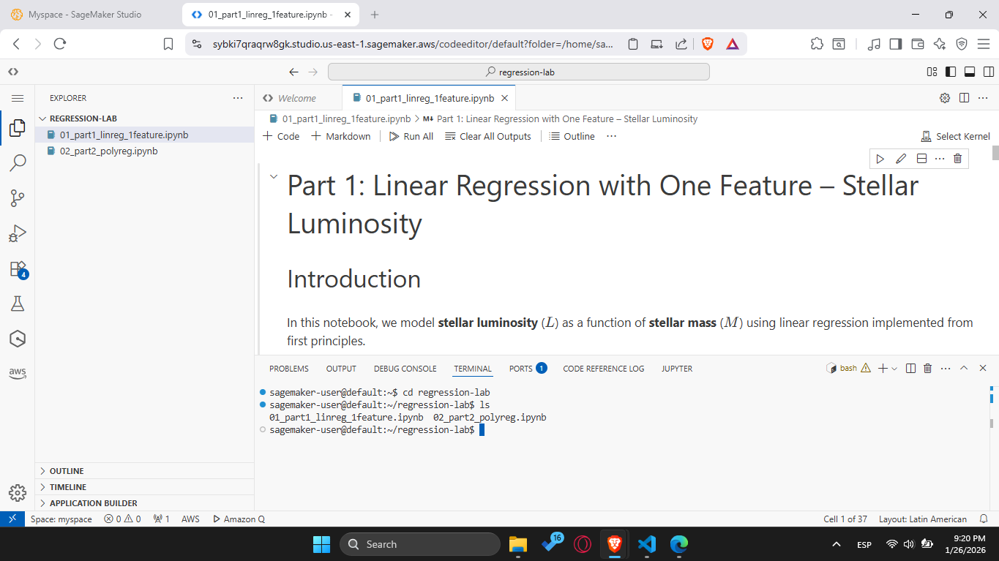
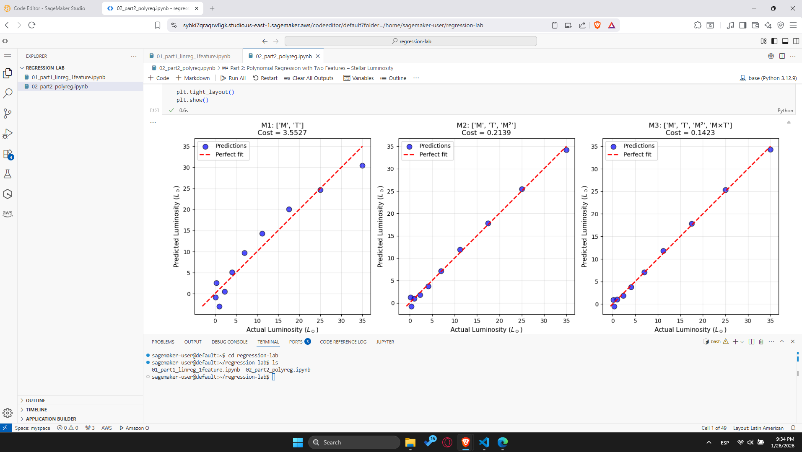

# Stellar Luminosity Regression

## Linear and Polynomial Models for Regression — From First Principles

[](https://www.python.org/)
[](https://numpy.org/)
[](https://matplotlib.org/)
[](https://aws.amazon.com/sagemaker/)

---

## 📖 Overview

This project implements **linear regression** and **polynomial regression** from scratch, without using high-level machine learning libraries. The astronomical problem studied is **stellar luminosity modeling**: predicting a star's luminosity based on its mass and temperature.

### Why From Scratch?

As future enterprise architects, understanding ML fundamentals is essential. Rather than treating models as black boxes, this project builds:
- Hypothesis functions
- Cost functions (MSE)
- Gradient computation (both loop-based and vectorized)
- Gradient descent optimization

This foundational knowledge is critical when deploying, scaling, and debugging ML systems in production environments.

---

## 🗂️ Repository Structure

```
/
├── README.md                           # This file
├── 01_part1_linreg_1feature.ipynb      # Linear regression (single feature)
└── 02_part2_polyreg.ipynb              # Polynomial regression (multiple features)
```

---

## 📊 Dataset

The dataset represents main-sequence stars with the following properties:

| Variable | Description | Units |
|----------|-------------|-------|
| **M** | Stellar mass | Solar masses (M☉) |
| **T** | Effective temperature | Kelvin (K) |
| **L** | Stellar luminosity | Solar luminosities (L☉) |

### Data Values

```python
M = [0.6, 0.8, 1.0, 1.2, 1.4, 1.6, 1.8, 2.0, 2.2, 2.4]
T = [3800, 4400, 5800, 6400, 6900, 7400, 7900, 8300, 8800, 9200]
L = [0.15, 0.35, 1.00, 2.30, 4.10, 7.00, 11.2, 17.5, 25.0, 35.0]
```

---

## 📓 Notebook 1: Linear Regression (Single Feature)

**File:** `01_part1_linreg_1feature.ipynb`

**Model:** $\hat{L} = w \cdot M + b$

### What's Implemented

| Section | Description |
|---------|-------------|
| Dataset Visualization | Scatter plot of M vs L with linearity analysis |
| Prediction & Cost | `predict()` and `compute_cost()` functions (MSE) |
| Cost Surface | 3D surface and contour plots of J(w,b) |
| Gradients (Non-Vectorized) | Loop-based gradient computation |
| Gradients (Vectorized) | NumPy-based gradient computation |
| Gradient Descent | Training loop with cost history tracking |
| Convergence Analysis | Loss vs iterations plot |
| Learning Rate Experiments | Comparison of α = 0.01, 0.1, 0.5 |
| Final Fit | Regression line with residual analysis |
| Conceptual Questions | Astrophysical meaning of w; linear model limitations |

### Key Results

| Learning Rate | Final w | Final b | Final Cost |
|---------------|---------|---------|------------|
| α = 0.01 | ~18 | ~-17 | Higher (slow convergence) |
| α = 0.1 | ~18.4 | ~-17.2 | ~6.7 |
| α = 0.5 | ~18.4 | ~-17.2 | ~6.7 |

### Key Insights

- **Astrophysical meaning of w:** The slope represents the average rate of luminosity increase per solar mass (~18 L☉ per M☉)
- **Linear limitation:** The true mass-luminosity relation follows a power law (L ∝ M^3.5), not a straight line. The linear model systematically underestimates at extremes.

---

## 📓 Notebook 2: Polynomial Regression (Multiple Features)

**File:** `02_part2_polyreg.ipynb`

**Model:** $\hat{L} = \mathbf{X} \mathbf{w} + b$

**Feature Map:** $\mathbf{X} = [M, T, M^2, M \times T]$

### What's Implemented

| Section | Description |
|---------|-------------|
| Dataset Visualization | L vs M with temperature color-coding + 3D plot |
| Feature Engineering | `build_features()` with NumPy vectorization |
| Feature Scaling | Z-score standardization |
| Vectorized Loss & Gradients | MSE and gradients for multi-feature model |
| Gradient Descent | Training with convergence tracking |
| Feature Selection | Comparison of M1, M2, M3 models |
| Interaction Analysis | Cost vs w_MT sensitivity plot |
| Inference Demo | Prediction for new star (M=1.3, T=6600) |

### Model Comparison

| Model | Features | Final Cost | Improvement |
|-------|----------|------------|-------------|
| M1 | [M, T] | ~3.55 | Baseline |
| M2 | [M, T, M²] | ~0.21 | Significant |
| M3 | [M, T, M², M×T] | **~0.14** | Best fit |

### Key Insights

- **M² term:** Captures the nonlinear (power-law) mass-luminosity relationship
- **M×T interaction:** Hot, massive stars are disproportionately luminous — the interaction term captures this synergy
- **Inference result:** New star (M=1.3, T=6600) → L ≈ 2.56 L☉ (reasonable, falls between training points)

---

## 🧠 Core Concepts

### Gradient Descent (Intuition)

Gradient descent is an iterative optimization algorithm:

1. **Start** with initial guesses for parameters (w=0, b=0)
2. **Compute** how wrong the model is (cost function)
3. **Calculate** which direction to adjust parameters (gradients)
4. **Update** parameters in the direction that reduces cost
5. **Repeat** until convergence

The **learning rate (α)** controls step size:
- Too small → slow convergence
- Too large → overshooting, instability

### Vectorization

**Non-vectorized:** Explicit loop over each data point
```python
for i in range(m):
    dj_dw += (y_hat[i] - y[i]) * x[i]
```

**Vectorized:** NumPy operations on entire arrays
```python
dj_dw = (1/m) * np.sum((y_hat - y) * x)
```

Both produce identical results; vectorized is faster.

---

## ☁️ AWS SageMaker Execution Evidence

### Upload Process

<!-- TODO: Describe how you uploaded the notebooks to SageMaker -->
1. Accessed AWS SageMaker through the AWS Console
2. Created/opened a SageMaker Notebook Instance (or SageMaker Studio)
3. Uploaded both `.ipynb` files to the SageMaker environment
4. Selected the appropriate Python kernel with NumPy and Matplotlib

### Screenshots

#### Both Notebooks in SageMaker

<!-- TODO: Insert screenshot showing both notebooks visible in SageMaker file browser -->


#### Successful Execution - Notebook 1

<!-- TODO: Insert screenshot showing cells executed with outputs in Notebook 1 -->


#### Successful Execution - Notebook 2

<!-- TODO: Insert screenshot showing cells executed with outputs in Notebook 2 -->


#### Plot Rendered in SageMaker

<!-- TODO: Insert screenshot showing at least one plot rendered in SageMaker -->


### Local vs SageMaker Comparison

<!-- TODO: Add your observations here -->
| Aspect | Local Execution | SageMaker Execution |
|--------|-----------------|---------------------|
| Environment Setup | Pre-configured | Managed kernel |
| Execution Speed | [Your observation] | [Your observation] |
| Plot Rendering | Inline (matplotlib) | Inline (matplotlib) |
| Differences | [Any issues or differences] | [Any issues or differences] |

---

## 🛠️ Technologies Used

| Technology | Purpose |
|------------|---------|
| **Python 3.8+** | Programming language |
| **NumPy** | Numerical computations, vectorization |
| **Matplotlib** | Data visualization, inline plots |
| **AWS SageMaker** | Cloud notebook execution |

### Not Used (As Required)

- ❌ scikit-learn
- ❌ statsmodels
- ❌ TensorFlow / PyTorch
- ❌ Any high-level ML/optimization library

---

## 🚀 How to Run

### Local Execution

```bash
# Clone the repository
git clone <repository-url>
cd regression

# Install dependencies (if needed)
pip install numpy matplotlib

# Open notebooks
jupyter notebook
```

### AWS SageMaker

1. Upload `.ipynb` files to SageMaker
2. Select Python 3 kernel with NumPy/Matplotlib
3. Run all cells

---

## 👤 Author

**[Your Name]**

Machine Learning Bootcamp — Digital Transformation and Enterprise Architecture

---

## 📄 License

This project is for educational purposes as part of the ML Bootcamp coursework.
